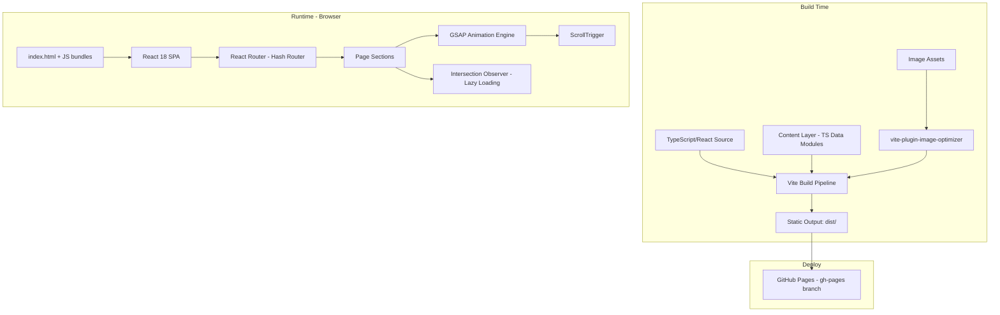
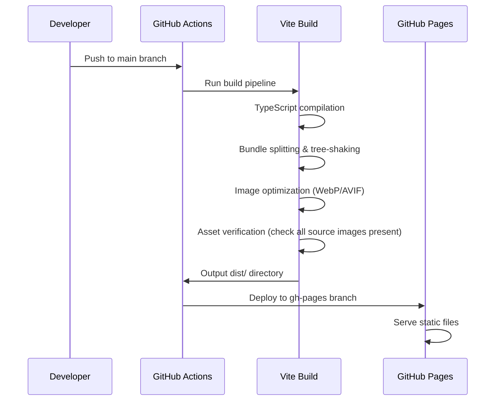
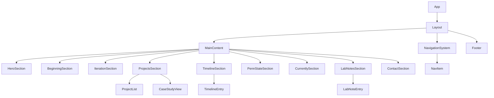

# Design Document: Portfolio Redesign

## Overview

This design transforms the existing static HTML/CSS/JS portfolio into a narrative-driven, cinematic engineering portfolio built with React 18 + Vite 5. The site tells a story — Tomas's journey from FIRST Robotics and hands-on building through mechanical engineering, CAD, software, and independent projects — presented as a continuous scrolling narrative with chapter-like sections.

The architecture prioritizes:
- **Static output**: Vite produces pre-built HTML/CSS/JS for GitHub Pages (no server required)
- **Narrative structure**: Sections flow as chapters, driven by scroll-triggered GSAP animations
- **Content separation**: All factual data lives in TypeScript data modules, decoupled from components
- **Performance**: Code splitting, lazy loading, and image optimization for sub-1.5s FCP
- **Accessibility**: Semantic HTML, keyboard navigation, reduced motion support, WCAG contrast compliance

The existing site uses Poppins font, ScrollReveal, MixItUp filtering, and Swiper. The redesign replaces all three libraries with GSAP (for animation), React components (for filtering/interaction), and a custom case study system (replacing the card grid).

## Architecture

### High-Level System Diagram



### Technology Stack

| Layer | Technology | Rationale |
|-------|-----------|-----------|
| Framework | React 18 | Component-based architecture, existing familiarity |
| Build Tool | Vite 5 | Fast HMR, native ESM, excellent tree-shaking, simple GitHub Pages config |
| Language | TypeScript | Type safety for content layer schemas and component props |
| Animation | GSAP + ScrollTrigger + @gsap/react | Industry-standard scroll animation, auto-cleanup via `useGSAP` hook |
| Routing | react-router-dom (HashRouter) | SPA routing on GitHub Pages without server rewrites |
| Styling | CSS Modules + CSS Custom Properties | Scoped styles, design token system, no runtime overhead |
| Image Optimization | vite-plugin-image-optimizer (Sharp) | Build-time WebP/AVIF conversion with fallbacks |
| Deployment | GitHub Actions → gh-pages branch | Automated CI/CD, rollback via git history |

### Build and Deployment Flow



## Components and Interfaces

### Component Hierarchy



### Core Component Interfaces

```typescript
// src/components/Layout/Layout.tsx
interface LayoutProps {
  children: React.ReactNode;
}

// src/components/Navigation/NavigationSystem.tsx
interface NavigationSystemProps {
  sections: SectionMeta[];
  activeSection: string;
  onNavigate: (sectionId: string) => void;
}

interface SectionMeta {
  id: string;
  label: string;
  icon?: React.ReactNode;
}

// src/components/sections/HeroSection.tsx
interface HeroSectionProps {
  name: string;
  tagline: string;
  visualElement: React.ReactNode;
}

// src/components/sections/ProjectsSection.tsx
interface ProjectsSectionProps {
  projects: CaseStudyData[];
}

// src/components/projects/CaseStudyView.tsx
interface CaseStudyViewProps {
  project: CaseStudyData;
  onClose: () => void;
}

// src/components/sections/TimelineSection.tsx
interface TimelineSectionProps {
  entries: TimelineEntryData[];
}

// src/components/sections/ContactSection.tsx
interface ContactSectionProps {
  contacts: ContactMethod[];
  socialLinks: SocialLink[];
}
```

### Animation Engine Interface

```typescript
// src/animation/useScrollAnimation.ts
interface ScrollAnimationConfig {
  trigger: string | HTMLElement;
  start?: string;        // default: "top 80%"
  end?: string;          // default: "bottom 20%"
  scrub?: boolean | number;
  animation: gsap.TweenVars;
  reducedMotionFallback?: gsap.TweenVars; // instant state with duration: 0
}

// src/animation/AnimationProvider.tsx
interface AnimationContextValue {
  isReducedMotion: boolean;
  registerAnimation: (config: ScrollAnimationConfig) => void;
  contextSafe: (fn: () => void) => () => void;
}

// src/hooks/useReducedMotion.ts
function useReducedMotion(): boolean;
// Returns true when prefers-reduced-motion: reduce is active
```

### Content Layer Interface

```typescript
// src/data/types.ts
interface CaseStudyData {
  id: string;
  title: string;
  summary: string;
  technologies: string[];
  description?: string;
  images?: string[];
  repositoryUrl?: string;
  caseStudySections?: CaseStudySection[];
}

interface CaseStudySection {
  heading: string;
  body: string;
}

interface TimelineEntryData {
  date: string;
  title: string;
  description: string;
}

interface LabNoteData {
  date: string;
  content: string;
}

interface SectionContent {
  id: string;
  title?: string;
  body: string;
  images?: string[];
}

interface ContactMethod {
  type: 'email' | 'whatsapp' | 'discord';
  label: string;
  value: string;
  href: string;
}

interface SocialLink {
  platform: 'github' | 'twitter' | 'instagram' | 'discord';
  url: string;
  label: string;
}

interface SiteMetadata {
  name: string;
  title: string;
  description: string;
  ogImage: string;
  baseUrl: string;
  faviconSizes: { size: string; href: string }[];
}
```

### Project Directory Structure

```
src/
├── main.tsx                    # Entry point
├── App.tsx                     # Root component with router
├── vite-env.d.ts
├── components/
│   ├── Layout/
│   │   ├── Layout.tsx
│   │   └── Layout.module.css
│   ├── Navigation/
│   │   ├── NavigationSystem.tsx
│   │   ├── NavItem.tsx
│   │   └── Navigation.module.css
│   ├── sections/
│   │   ├── HeroSection.tsx
│   │   ├── BeginningSection.tsx
│   │   ├── IterationSection.tsx
│   │   ├── ProjectsSection.tsx
│   │   ├── TimelineSection.tsx
│   │   ├── PennStateSection.tsx
│   │   ├── CurrentlySection.tsx
│   │   ├── LabNotesSection.tsx
│   │   └── ContactSection.tsx
│   ├── projects/
│   │   ├── ProjectList.tsx
│   │   ├── CaseStudyView.tsx
│   │   └── Projects.module.css
│   ├── timeline/
│   │   ├── TimelineEntry.tsx
│   │   └── Timeline.module.css
│   └── ui/
│       ├── Button.tsx
│       ├── SectionWrapper.tsx
│       └── VisualMotif.tsx
├── animation/
│   ├── AnimationProvider.tsx
│   ├── useScrollAnimation.ts
│   ├── useReducedMotion.ts
│   └── presets.ts             # Reusable animation configs
├── data/
│   ├── types.ts               # All TypeScript interfaces
│   ├── projects.ts            # CaseStudyData[]
│   ├── timeline.ts            # TimelineEntryData[]
│   ├── labNotes.ts            # LabNoteData[]
│   ├── sections.ts            # SectionContent for narrative sections
│   ├── contacts.ts            # ContactMethod[] and SocialLink[]
│   └── metadata.ts            # SiteMetadata
├── hooks/
│   ├── useActiveSection.ts    # Intersection Observer for nav highlighting
│   ├── useLazyLoad.ts         # Image/asset lazy loading
│   └── useEasterEgg.ts        # Easter egg interaction detection
├── styles/
│   ├── global.css             # CSS reset, custom properties, base styles
│   ├── tokens.css             # Design token definitions
│   └── typography.css         # Type scale and font declarations
├── assets/
│   ├── img/                   # All migrated images
│   ├── pdf/                   # Resume PDF
│   └── favicons/              # Favicon files
└── utils/
    ├── assetVerification.ts   # Build-time asset check
    └── scrollUtils.ts         # Smooth scroll helpers
```

## Data Models

### Content Layer Data Files

All content is stored in `src/data/` as TypeScript modules, providing type safety and import-time validation.

**Projects data (`src/data/projects.ts`)**:
```typescript
export const projects: CaseStudyData[] = [
  {
    id: "pathfinding-visualizer",
    title: "Pathfinding Visualizer",
    summary: "Interactive visualization of graph traversal algorithms",
    technologies: ["Java", "Swing", "Graph Theory"],
    repositoryUrl: "https://github.com/Doctorpizza357/Path_Finding_Algorithm_Visualizer",
    images: ["/assets/img/pathFinding.png"],
    caseStudySections: [
      { heading: "Context", body: "..." },
      { heading: "Process", body: "..." },
      { heading: "Technical Details", body: "..." }
    ]
  },
  // ... all 11 existing projects
];
```

**Timeline data (`src/data/timeline.ts`)**:
```typescript
export const timeline: TimelineEntryData[] = [
  {
    date: "2020",
    title: "Started Programming",
    description: "Began learning Python and building first projects"
  },
  // ... entries from Content_Layer
];
```

**Section content (`src/data/sections.ts`)**:
```typescript
export const sections: Record<string, SectionContent | null> = {
  beginning: { id: "beginning", title: "The Beginning", body: "..." },
  iteration: { id: "iteration", title: "Iteration", body: "..." },
  pennState: { id: "penn-state", title: "Penn State", body: "..." },
  currently: { id: "currently", title: "Currently", body: "..." },
  labNotes: null, // Omitted from render when null
};
```

### Design Token System

```css
/* src/styles/tokens.css */
:root {
  /* Color Palette */
  --color-bg-primary: #1a1a1a;
  --color-bg-secondary: #2a2a2a;
  --color-text-primary: #fafafa;
  --color-text-secondary: #9a9a9a;
  --color-text-muted: #6b6b6b;
  --color-accent: #4a9eff;         /* Engineering blue - used sparingly */
  --color-accent-dim: #4a9eff22;

  /* Typography Scale */
  --font-display: 'Inter', sans-serif;
  --font-mono: 'JetBrains Mono', monospace;

  --text-hero: clamp(3rem, 8vw, 6rem);
  --text-section-title: clamp(2rem, 4vw, 3.5rem);
  --text-subsection: clamp(1.25rem, 2.5vw, 1.75rem);
  --text-body: clamp(1rem, 1.5vw, 1.125rem);
  --text-meta: clamp(0.875rem, 1vw, 0.9375rem);

  /* Spacing */
  --section-gap: clamp(6rem, 12vh, 10rem);
  --content-max-width: 1200px;
  --content-padding: clamp(1rem, 4vw, 3rem);

  /* Animation */
  --duration-fast: 200ms;
  --duration-normal: 400ms;
  --duration-slow: 800ms;
  --ease-out: cubic-bezier(0.16, 1, 0.3, 1);

  /* Focus */
  --focus-ring: 2px solid var(--color-accent);
  --focus-offset: 2px;
}

@media (prefers-reduced-motion: reduce) {
  :root {
    --duration-fast: 0ms;
    --duration-normal: 0ms;
    --duration-slow: 0ms;
  }
}
```

### Vite Configuration

```typescript
// vite.config.ts
import { defineConfig } from 'vite';
import react from '@vitejs/plugin-react';
import { ViteImageOptimizer } from 'vite-plugin-image-optimizer';

export default defineConfig({
  base: '/<repo-name>/',  // Matches GitHub Pages path
  plugins: [
    react(),
    ViteImageOptimizer({
      png: { quality: 80 },
      jpeg: { quality: 80 },
      webp: { quality: 80 },
      avif: { quality: 65 },
    }),
  ],
  build: {
    rollupOptions: {
      output: {
        manualChunks: {
          gsap: ['gsap'],
          react: ['react', 'react-dom'],
        },
      },
    },
  },
});
```

### Navigation Active Section Detection

The `useActiveSection` hook uses Intersection Observer (not scroll event listeners) to efficiently determine which section occupies the majority of the viewport:

```typescript
// src/hooks/useActiveSection.ts
export function useActiveSection(sectionIds: string[]): string {
  const [activeSection, setActiveSection] = useState(sectionIds[0]);

  useEffect(() => {
    const observers = sectionIds.map(id => {
      const el = document.getElementById(id);
      if (!el) return null;

      const observer = new IntersectionObserver(
        ([entry]) => {
          if (entry.isIntersecting && entry.intersectionRatio > 0.5) {
            setActiveSection(id);
          }
        },
        { threshold: [0.5] }
      );
      observer.observe(el);
      return { observer, el };
    });

    return () => {
      observers.forEach(o => o?.observer.disconnect());
    };
  }, [sectionIds]);

  return activeSection;
}
```

### Reduced Motion Integration

```typescript
// src/animation/useReducedMotion.ts
export function useReducedMotion(): boolean {
  const [reduced, setReduced] = useState(() =>
    window.matchMedia('(prefers-reduced-motion: reduce)').matches
  );

  useEffect(() => {
    const mq = window.matchMedia('(prefers-reduced-motion: reduce)');
    const handler = (e: MediaQueryListEvent) => setReduced(e.matches);
    mq.addEventListener('change', handler);
    return () => mq.removeEventListener('change', handler);
  }, []);

  return reduced;
}
```

### GSAP Animation Pattern with React

Using the official `@gsap/react` package's `useGSAP` hook for automatic cleanup:

```typescript
// Example: Section fade-in animation
import { useGSAP } from '@gsap/react';
import gsap from 'gsap';
import { ScrollTrigger } from 'gsap/ScrollTrigger';

gsap.registerPlugin(ScrollTrigger);

function SectionWrapper({ children, id }: { children: React.ReactNode; id: string }) {
  const container = useRef<HTMLElement>(null);
  const isReduced = useReducedMotion();

  useGSAP(() => {
    if (isReduced) return; // Skip animation setup entirely

    gsap.from(container.current, {
      opacity: 0,
      y: 60,
      duration: 0.8,
      ease: 'power2.out',
      scrollTrigger: {
        trigger: container.current,
        start: 'top 80%',
        end: 'top 40%',
        toggleActions: 'play none none none',
      },
    });
  }, { scope: container, dependencies: [isReduced] });

  return (
    <section ref={container} id={id}>
      {children}
    </section>
  );
}
```


## Correctness Properties

*A property is a characteristic or behavior that should hold true across all valid executions of a system — essentially, a formal statement about what the system should do. Properties serve as the bridge between human-readable specifications and machine-verifiable correctness guarantees.*

### Property 1: Section content rendering

*For any* section identifier (Beginning, Iteration, PennState, Currently, LabNotes) with a valid non-null `SectionContent` object, rendering that section component should produce DOM output containing the content's title and body text.

**Validates: Requirements 2.4, 2.5, 2.6, 2.7, 2.8**

### Property 2: Null content omission

*For any* section identifier whose corresponding Content_Layer value is null or undefined, the rendered homepage should not contain a DOM element with that section's ID, and the narrative order of remaining sections should be preserved.

**Validates: Requirements 2.9**

### Property 3: Case study structure completeness

*For any* valid `CaseStudyData` object with all four `caseStudySections` populated (context, process, technical details, visual documentation), the rendered `CaseStudyView` should produce distinct content blocks for each section type.

**Validates: Requirements 4.1**

### Property 4: Project listing displays title and summary

*For any* valid `CaseStudyData` object, the project listing view should render both the project's title text and its summary text as visible content.

**Validates: Requirements 4.2**

### Property 5: Case study selection reveals full content

*For any* valid `CaseStudyData` in the project list, selecting that project should cause the full case study view to render, displaying all populated fields from the data object, and providing a visible control to return to the listing.

**Validates: Requirements 4.3**

### Property 6: Repository link conditional rendering

*For any* `CaseStudyData`, if `repositoryUrl` is defined and non-empty, the rendered case study should contain an anchor element linking to that URL; if `repositoryUrl` is undefined or empty, no repository link element should be present in the rendered output.

**Validates: Requirements 4.5, 4.6**

### Property 7: Reduced motion disables all movement animations

*For any* animation configuration in the system, when `prefers-reduced-motion: reduce` is active, all opacity, transform, and position animations should apply with duration 0ms (instant state change), while preserving the final visual state so content remains visible in its end position.

**Validates: Requirements 5.4, 7.3**

### Property 8: Animation duration cap

*For any* animation configuration defined in the animation presets, the duration value should not exceed 2000 milliseconds.

**Validates: Requirements 5.5**

### Property 9: Heading hierarchy validity

*For any* valid content configuration rendered as the full page, the DOM should contain exactly one `h1` element, and heading levels (h1 through h6) should not skip ranks (e.g., h1 followed by h3 without an intervening h2).

**Validates: Requirements 7.1**

### Property 10: Image alt text constraints

*For any* image rendered by the Portfolio_Site, if the image is non-decorative (informational), its alt attribute should be non-empty and at most 125 characters; if the image is decorative, its alt attribute should be an empty string.

**Validates: Requirements 7.4**

### Property 11: Color contrast compliance

*For any* text color / background color pair defined in the design token system, the computed contrast ratio should be at least 4.5:1 for normal-sized text (below 18px or below 14px bold) and at least 3:1 for large text (18px and above, or 14px bold and above).

**Validates: Requirements 7.5**

### Property 12: Content data schema validation

*For any* object in the Content_Layer data arrays, required fields must be present and correctly typed: `CaseStudyData` requires `title` (string), `summary` (string), `technologies` (string array); `TimelineEntryData` requires `date` (string), `title` (string), `description` (string); `LabNoteData` requires `date` (string), `content` (string).

**Validates: Requirements 9.2, 9.4, 9.5**

### Property 13: Navigation items reflect available sections in narrative order

*For any* subset of sections with non-null content in the Content_Layer, the Navigation_System should render navigation items for exactly those sections, in the canonical narrative order (Hero, Beginning, Iteration, Projects, Timeline, PennState, Currently, LabNotes, Contact).

**Validates: Requirements 10.1**

### Property 14: Single active navigation item

*For any* scroll position within the page content, the `useActiveSection` hook should return exactly one section ID as active, and that ID should correspond to the section currently occupying the majority of the viewport.

**Validates: Requirements 10.3**

### Property 15: Timeline chronological ordering

*For any* array of `TimelineEntryData` provided to the Timeline_Section, the rendered output should display entries in chronological order (earliest date first), regardless of the input array order.

**Validates: Requirements 11.1**

### Property 16: Social links open in new tab

*For any* `SocialLink` in the content layer, the rendered anchor element should have `target="_blank"` and `rel="noopener noreferrer"` attributes.

**Validates: Requirements 12.2**

### Property 17: Metadata length constraints

*For any* `SiteMetadata` object, the `title` field should have a length of at most 60 characters and the `description` field should have a length of at most 160 characters.

**Validates: Requirements 13.1**

### Property 18: Optional field omission

*For any* `CaseStudyData` with one or more optional fields (`description`, `images`, `repositoryUrl`, `caseStudySections`) set to undefined, the rendered output should not contain placeholder text, empty containers, or broken references for those fields.

**Validates: Requirements 14.4**

### Property 19: Asset verification completeness

*For any* set of source image files in `assets/img/` and the resume PDF in `assets/pdf/`, if the build output is missing one or more of these files, the asset verification function should return a failure result listing each missing asset by filename.

**Validates: Requirements 15.5**

## Error Handling

### Build-Time Errors

| Error Condition | Handling Strategy |
|----------------|-------------------|
| Missing source asset in build output | Asset verification script fails the build with a list of missing files |
| TypeScript type error in content data | Build fails at compilation — TypeScript enforces schema on data modules |
| Image optimization failure | vite-plugin-image-optimizer logs the failing file; build continues with unoptimized original |
| Bundle exceeds 150KB gzip threshold | CI warning (non-blocking) — tracked via bundle size monitoring |

### Runtime Errors

| Error Condition | Handling Strategy |
|----------------|-------------------|
| Content section is null/undefined | Section component renders nothing (returns `null`) — no error boundary needed |
| Image fails to load | CSS background fallback (dark surface color); no broken image icon |
| GSAP animation target not in DOM | `useGSAP` hook with scope prevents targeting elements outside component |
| Intersection Observer unsupported | Graceful degradation — first section marked active by default |
| Hash route not matching any section | Scroll to top of page (Hero section) |
| Easter egg interaction fails | Silent failure — no user-visible error. Console warning for debugging |

### Error Boundary Strategy

A top-level React Error Boundary wraps the main content area. If a section component throws during render:
1. The boundary catches the error
2. Logs the error to console
3. Renders a minimal fallback (the section is simply omitted from the page)
4. Other sections continue to render normally

The Navigation_System and Layout are outside the error boundary to ensure navigation always works.

## Testing Strategy

### Dual Testing Approach

This project uses both unit/example tests and property-based tests for comprehensive coverage.

**Property-Based Testing Library**: [fast-check](https://github.com/dubzzz/fast-check) (TypeScript-native, integrates with Vitest)

**Test Runner**: Vitest (native Vite integration, fast execution)

### Property-Based Tests

Each correctness property maps to a property-based test with minimum 100 iterations:

- **Tag format**: `Feature: portfolio-redesign, Property {N}: {title}`
- **Framework**: fast-check with Vitest
- **Configuration**: `fc.assert(fc.property(...), { numRuns: 100 })`

Properties 1–19 will be implemented as individual property tests using fast-check generators for:
- `CaseStudyData` (arbitrary titles, summaries, tech arrays, optional fields)
- `TimelineEntryData` (arbitrary dates, titles, descriptions)
- `LabNoteData` (arbitrary dates, content strings)
- `SectionContent` (arbitrary section identifiers with title/body)
- `SiteMetadata` (arbitrary strings within length constraints)
- Animation config objects (arbitrary durations, easing values)
- Color pairs (arbitrary hex colors within the palette range)

### Unit / Example Tests

| Area | Test Description |
|------|-----------------|
| Build output | Verify 404.html exists with redirect content |
| Build output | Verify static-only output (no .php, no server scripts) |
| Vite config | Verify base path matches GitHub Pages URL |
| Hero Section | Verify min-height: 100vh and required elements render |
| Existing projects | Verify all 11 project titles exist in data |
| Contact Section | Verify email mailto: link, all social links present |
| SEO | Verify OG tags, canonical URL, favicon links in document head |
| Nav | Verify keyboard tab order and Enter/Space activation |
| Responsive | Verify nav tap targets >= 44px at mobile viewport |
| Typography | Verify hero title >= 3x body text size |
| Easter eggs | Verify they don't alter tab order or accessibility tree |

### Integration Tests

| Area | Test Description |
|------|-----------------|
| Performance | Lighthouse CI — FCP < 1.5s on 4G throttle |
| Performance | Text content interactive within 5s on 3G |
| Build pipeline | Full build produces valid static output with all assets |
| Deployment | gh-pages branch receives correct dist/ contents |

### Smoke Tests

| Area | Test Description |
|------|-----------------|
| Dependencies | Verify GSAP, React, Vite in package.json |
| File structure | Verify src/data/ directory contains required modules |
| Image formats | Verify dist/ contains WebP/AVIF versions |
| Bundle size | Verify no JS chunk exceeds 150KB gzipped |

### Test File Organization

```
src/
├── __tests__/
│   ├── properties/
│   │   ├── content-rendering.property.test.ts
│   │   ├── case-study.property.test.ts
│   │   ├── navigation.property.test.ts
│   │   ├── animation.property.test.ts
│   │   ├── accessibility.property.test.ts
│   │   ├── content-schema.property.test.ts
│   │   └── asset-verification.property.test.ts
│   ├── unit/
│   │   ├── HeroSection.test.tsx
│   │   ├── ContactSection.test.tsx
│   │   ├── NavigationSystem.test.tsx
│   │   └── useReducedMotion.test.ts
│   └── integration/
│       ├── build-output.test.ts
│       └── lighthouse.test.ts
└── test-utils/
    ├── generators.ts          # fast-check arbitraries for content types
    └── render-helpers.ts      # Testing-library setup with providers
```
