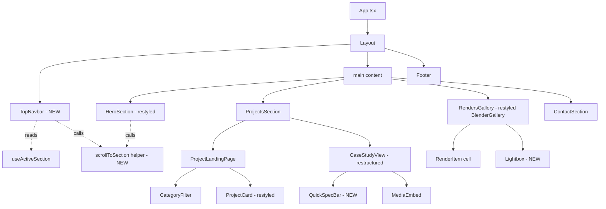
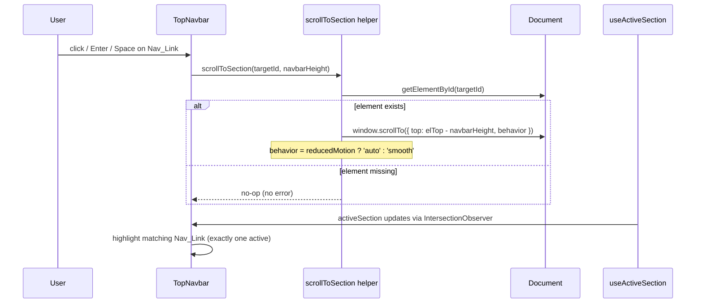

# Design Document

## Overview

This design modernizes the portfolio's UI into a clean, product-design aesthetic (Linear/Vercel reference) while preserving the underlying project data architecture, filtering behavior, 3D model viewer, and accessibility guarantees established by the `project-section-overhaul` spec.

The core structural change is replacing the left floating dot navigation (`NavigationSystem`) with a **top sticky glassmorphism navbar**, replacing the animated constellation hero (`HeroVisual`) with a **calm matte typographic hero**, restyling the projects grid into a **responsive card grid** with disciplined breakpoints, restructuring the case study into a **standardized engineering documentation layout** with a Quick Spec Bar, and upgrading the renders gallery with a **full accessible lightbox** (focus trap, keyboard nav, video controls, error handling).

The application remains a Vite + React 18 + TypeScript SPA deployed to GitHub Pages via `HashRouter`. All visual values continue to flow from the centralized token system in `src/styles/tokens.css`. No project data, filtering logic (`filterProjects`, `sortByDisplayOrder`), or the `ModelViewer` behavior changes — this spec governs presentation and layout, layering new components and token values over the existing data layer.

### Design Goals

- Replace side navigation with a persistent, accessible top navbar that drives smooth section scrolling with a navbar-height offset.
- Deliver a focused hero (single H1, subtitle, focus tags, two CTAs) with a matte, non-animated background.
- Present projects as a responsive 3/2/1-column card grid preserving the `id="projects"` anchor and existing filtering.
- Structure case studies as ordered engineering documentation sections with a metadata Quick Spec Bar.
- Provide a fully accessible renders lightbox: keyboard operable, focus-trapped, scroll-locked, with prev/next navigation, captions, video controls, and load-failure handling.
- Source every color, type, and spacing value from `Design_Tokens`; add tokens where the new theme requires them.
- Honor `prefers-reduced-motion` across all new surfaces.

### Key Design Decisions

| Decision | Rationale |
|----------|-----------|
| Extend `tokens.css` with new theme values (`#090a0f` base, `#161b22` surface, `#30363d` border, cobalt accent) rather than replacing the file | Requirement 13 mandates specific token values; a token-first approach keeps components free of hardcoded values (Req 6.5, 13.6) and preserves the reduced-motion override already present. |
| Replace `NavigationSystem` with a new `TopNavbar` component instead of retrofitting the sidebar | The sidebar's dot/drawer model is incompatible with a top sticky bar; a clean component keeps concerns separated and makes the "do not render dot nav" requirement (1.1) unambiguous. |
| Reuse existing scroll orchestration (`useActiveSection`, `App.handleNavigate`) and extend it with a navbar-offset scroll helper | Active-section detection and hash sync already exist; adding offset scrolling avoids duplicating logic (Req 1.5, 1.11). |
| Keep the existing `ProjectData` model and data-layer utilities untouched | Req 14.1 requires preserving the data layer; card/case-study/lightbox all read from `projectsNew.ts` and `blenderGallery.ts` as source of truth. |
| Build a single reusable `Lightbox` component with a focus-trap hook | Req 12 demands full modal a11y (trap, escape, scroll lock, focus restore); centralizing this avoids the partial implementation in the current `BlenderGallery`. |
| CSS Modules per component (matching existing convention) | The codebase already uses `*.module.css`; continuing this keeps styling encapsulated and token-driven. |

## Architecture

### Component Hierarchy



### Navigation & Scroll Flow



### Module Responsibilities

- **`TopNavbar`** (new, `src/components/Navigation/TopNavbar.tsx`): Renders the sticky `<nav>` with wordmark + nav links, applies glassmorphism, computes/exposes its own rendered height, dispatches scroll requests, opens the resume link in a new tab, and reflects the active section.
- **`scrollToSection`** (new helper, `src/utils/scrollToSection.ts`): Pure-ish DOM helper that scrolls to a target id with a top offset equal to the navbar height, choosing smooth vs instant based on reduced-motion, and safely no-ops when the target is absent.
- **`HeroSection`** (restyled): Renders H1/subtitle/focus tags/CTAs over a matte background; removes `HeroVisual` (particles) and the misspelled descriptor.
- **`ProjectLandingPage` / `ProjectCard`** (restyled): Grid breakpoints 3/2/1; 16:9 preview, title, ≤200-char summary, tech pills, hover/focus behavior. Filtering logic unchanged.
- **`CaseStudyViewNew`** (restructured): Title heading, role/timeframe, `QuickSpecBar`, ordered content sections, back link.
- **`QuickSpecBar`** (new): Tools-used pills + optional repo/CAD link opening in a new tab.
- **`RendersGallery`** (restyled `BlenderGallery`) + **`Lightbox`** (new): Responsive grid with lazy loading + accessible modal with prev/next, captions, video controls, error state.
- **`tokens.css`** (extended): New theme tokens for the product-design palette and header letter-spacing.

## Components and Interfaces

### scrollToSection helper

```ts
// src/utils/scrollToSection.ts
export interface ScrollToSectionOptions {
  /** Rendered height of the sticky navbar, used as top offset. */
  offset: number;
  /** When true, jump instantly instead of smooth scrolling. */
  reducedMotion: boolean;
}

/**
 * Scrolls the viewport so the element with `id` aligns to the top of the
 * viewport minus `offset`. No-ops (no throw) when the element is absent.
 * Uses 'smooth' behavior unless reducedMotion is true, in which case 'auto'.
 */
export function scrollToSection(id: string, options: ScrollToSectionOptions): void;
```

Behavior notes:
- Computes `target = element.getBoundingClientRect().top + window.scrollY - offset`, clamped at `>= 0`.
- The wordmark target (`hero`) uses the same helper; offset applies uniformly.
- Guards `typeof window` for test/SSR safety, mirroring existing hooks.

### TopNavbar

```ts
// src/components/Navigation/TopNavbar.tsx
export interface NavLinkMeta {
  /** DOM id to scroll to, or 'resume' for the external PDF link. */
  target: string;
  label: string;
  /** True for the resume link, which opens the PDF in a new tab. */
  external?: boolean;
}

export interface TopNavbarProps {
  /** Ordered nav links: Projects, Renders, About, Resume, Contact. */
  links: NavLinkMeta[];
  /** Active section id from useActiveSection. */
  activeSection: string;
  /** Wordmark text, e.g. "Tomas Bentolila". */
  wordmark: string;
  /** Path to the resume PDF asset. */
  resumeHref: string;
}
```

Implementation details:
- Root element is `<nav aria-label="Primary">` (Req 2.1). Contained in a `<header>` fixed to the top.
- Fixed positioning: `position: sticky; top: 0` on the header (Req 1.2).
- Wordmark rendered as a `<button>` (or link) at the left; nav links right-aligned in the given order (Req 1.3, 1.4).
- Reports its rendered height via a `ResizeObserver` into a ref/state so `scrollToSection` uses the current offset (Req 1.5). Height is also written to a CSS variable `--navbar-height` for `scroll-margin-top` fallback.
- Resume link is an `<a href={resumeHref} target="_blank" rel="noopener noreferrer">` with visually-hidden "(opens in new tab)" text (Req 1.9, 2.6).
- Active link derived from `activeSection`; exactly one link carries the active class (Req 1.11). Resume/About links that are not scroll sections never take active state incorrectly (About maps to hero-adjacent content; see Data Models).
- Glassmorphism styling via tokens (Req 1.10): `backdrop-filter: blur(var(--navbar-blur))` (≥8px), translucent dark background (alpha 0.6–0.85), 1px bottom border using `--color-border`.
- Keyboard: links/wordmark are natively focusable interactive elements; Enter/Space activate (Req 1.5, 2.2). Visible focus ring ≥2px via `--focus-ring` (Req 2.3). Minimum 44×44px targets via padding (Req 2.4).

### HeroSection (restyled)

```ts
// src/components/sections/HeroSection.tsx
export interface HeroSectionProps {
  name: string;              // "Tomas Bentolila"
  subtitle: string;          // "Mechanical Engineering • Penn State"
  focusTags: string[];       // ["Mechanical Design", "CAD/FEA", "Robotics"]
  resumeHref: string;
  onViewWork: () => void;    // scrolls to #projects
}
```

- Single `<h1>` with `name` (Req 3.1); subtitle `<p>` (Req 3.2); focus tags rendered as a list of pills (Req 3.3).
- Removes `HeroVisual` and the descriptor text `"Mehchanical Engineering, Coding, Robotics"` entirely (Req 3.4, 5.2).
- H1 uses `--font-display` and `--header-letter-spacing` tokens (Req 3.5).
- Font-size hierarchy: H1 (`--text-hero`) > subtitle (`--text-subsection`) ≥ focus tags (`--text-meta`) (Req 3.6).
- Background: matte base color token in `#090a0f`–`#0f1117` range; optional static grid overlay at opacity ≤0.15 or a solid matte, with no animated elements (Req 5.1, 5.3). Under reduced motion, no motion-based animation (Req 5.4) — satisfied structurally since no animation is rendered.
- `Primary_Action_Button` "View Work" (filled) calls `onViewWork` → `scrollToSection('projects', …)` (Req 4.1, 4.2). `Secondary_Action_Button` "Resume" is an outline-styled `<a target="_blank" rel="noopener noreferrer">` (Req 4.3, 4.4). Both keyboard operable with ≥2px focus ring and ≥44×44px targets (Req 4.5, 4.6).

### ProjectCard & ProjectLandingPage (restyled)

- Grid template columns driven by media queries (Req 6.1–6.3):
  - `≥1024px`: `repeat(3, 1fr)`
  - `768px–1023px`: `repeat(2, 1fr)`
  - `<768px`: `1fr`
- Cards remain inside the `id="projects"` `SectionWrapper` (Req 6.4). No layout change to the section anchor.
- Each `ProjectCard` shows: 16:9 preview image (`aspect-ratio: 16 / 9`) (Req 7.1), title (Req 7.2), ≤200-char technical summary via `truncateSummary(description, 200)` (Req 7.3, already implemented), and tech pills from `project.technologies` (Req 7.4).
- Hover: accent-color border highlight + preview image `translateY(-2px…-8px)` (Req 7.5). Under reduced motion, border highlight applies without translate (Req 7.8) — achieved by gating the transform on a `prefers-reduced-motion` media query while keeping the border transition.
- Card is focusable (`tabIndex={0}`, `role="button"`) with ≥2px focus ring (Req 7.7); activates on click/Enter/Space (Req 7.6, already implemented).
- `CategoryFilter` unchanged in behavior (Req 8): options ALL/Mechanical/Robotics/Software/Systems, default ALL, single active, token-driven styling. Reduced-motion filter transition = 0ms is already handled by tokens.css durations → 0ms and the animation gating (Req 8.6).

### CaseStudyView (restructured) & QuickSpecBar (new)

```ts
// src/components/projects/QuickSpecBar.tsx
export interface QuickSpecBarProps {
  /** Tools/technologies used, rendered as pills. */
  tools: string[];
  /** Optional repository or CAD files URL. */
  resourceUrl?: string;
  /** Label for the resource link, e.g. "View on GitHub" / "CAD Files". */
  resourceLabel?: string;
}
```

- `CaseStudyView` renders the project title as the top heading (Req 9.1) using a higher heading level (H2) than section headings (H3) (Req 10.3).
- Role and timeframe rendered from `project.role` / `project.timeframe` (Req 9.2).
- `QuickSpecBar` shows tools from `project.technologies` (Req 9.3); when `repositoryUrl` or `liveUrl` is defined, shows a link opening in a new tab (`target="_blank" rel="noopener noreferrer"`) (Req 9.4).
- `Back_Link` labeled "← Back to Projects" (Req 9.5), keyboard operable (Req 9.7), invokes `onBack` to return to the landing view (Req 9.6).
- Content sections render **only present** sections in canonical order (Req 10.1). Because project data uses free-form section keys, the component maps well-known keys to the canonical order and appends any remaining sections in data order:
  - Canonical order: Problem Overview → Design & CAD Modeling → Prototyping & Fabrication → Outcome/Specifications.
  - A `SECTION_ORDER` map assigns rank to known keys; unknown keys keep their relative data order after ranked ones.
- Each section renders a heading + body (Req 10.2). If `caseStudySections` is empty/undefined, no empty content container is rendered (Req 10.4) — the existing guard already does this.
- Media embeds constrained to `max-width: 100%` of the section container with `height: auto` to preserve aspect ratio (Req 10.5), handled in `MediaEmbed`/`CaseStudyView.module.css`.

### RendersGallery (restyled) & Lightbox (new)

```ts
// src/components/gallery/RendersGallery.tsx  (evolved from BlenderGallery.tsx)
// Reads blenderGallery data; each GalleryItem gains an optional `software` caption source.

// src/components/gallery/Lightbox.tsx
export interface LightboxProps {
  items: GalleryItem[];
  /** Index of the currently displayed item. */
  index: number;
  /** Called with the new index when navigating prev/next. */
  onNavigate: (nextIndex: number) => void;
  /** Called to close the lightbox. */
  onClose: () => void;
}
```

- Gallery grid: responsive with uniform gutter from a spacing token (Req 11.2); single column `<768px` (Req 11.3). Items live inside `id="gallery"` `SectionWrapper` (Req 11.1).
- Lazy loading: grid images use `loading="lazy"` and/or the existing `useLazyLoad` hook with `rootMargin: '100vh'` so fetching begins within one viewport height (Req 11.4).
- Lightbox opens on click/Enter/Space of a render item (Req 12.1); for video items it renders `<video controls>` with play/pause/seek (Req 12.1).
- Caption displays the producing software/engine (`Blender` for current data; `Render_Caption`) (Req 12.2).
- Escape closes (Req 12.3); close control and backdrop click close (Req 12.4).
- Scroll lock while open via `document.documentElement.style.overflow = 'hidden'`, restored on close, preserving scroll position (Req 12.5).
- Focus returns to the triggering render item on close (Req 12.6) using a stored trigger ref.
- Focus trap: Tab/Shift+Tab cycles within the lightbox controls (Req 12.7) via a focus-trap effect (mirrors the existing drawer trap in `NavigationSystem`).
- Prev/Next controls operable by click and keyboard (Enter/Space/Arrow) replace the item + caption with the adjacent item in gallery order; first/last disables prev/next respectively (Req 12.8).
- Load failure: if the full-resolution source fails to load within 10s, keep the lightbox open, show a "could not load" indication, and retain selection so the user can navigate/close (Req 12.9). Implemented with an `onError` handler and a 10s timeout that flips to an error state without unmounting.

### Design Tokens (extended)

New/updated tokens in `src/styles/tokens.css` (Req 13). Existing tokens are retained for backward compatibility; new theme tokens are introduced and referenced by the modernized components.

```css
:root {
  /* Product-design theme palette (Req 13.1–13.4) */
  --color-bg-base: #090a0f;        /* base background */
  --color-surface-card: #161b22;   /* card surface */
  --color-border: #30363d;         /* subtle border */
  --color-accent: #3b82f6;         /* cobalt/steel blue accent (active states, pills) */

  /* Typography (Req 13.5) */
  --font-display: 'Inter', system-ui, -apple-system, 'Segoe UI', sans-serif;
  --header-letter-spacing: -0.02em; /* tight header tracking */

  /* Navbar glassmorphism (Req 1.10) */
  --navbar-blur: 12px;             /* ≥ 8px */
  --navbar-bg: rgba(9, 10, 15, 0.72); /* alpha within 0.6–0.85 */
  --navbar-height: 64px;           /* fallback; overwritten at runtime */

  /* Gallery spacing (Req 11.2) */
  --gallery-gutter: clamp(0.75rem, 1.5vw, 1.25rem);
}
```

Contrast: nav/link and body text colors are chosen so text-on-surface meets ≥4.5:1 (normal) / ≥3:1 (large) (Req 2.5, 13.7). The accent `#3b82f6` on `#090a0f` and text `#f5f5f5` on `#161b22` both clear 4.5:1.

## Data Models

No changes to the `ProjectData`, `MediaItem`, `CaseStudySection`, or `AnnotationData` interfaces (Req 14.1). The design reuses:

- `projects: ProjectData[]` from `src/data/projectsNew.ts` as the source for `ProjectCard` and `CaseStudyView`.
- `filterProjects` and `sortByDisplayOrder` from `src/data/projectTypes.ts` for category filtering (Req 8, unchanged).
- `blenderGallery: GalleryItem[]` from `src/data/blenderGallery.ts` as the source for `RendersGallery` and `Lightbox`.

### New / adjusted view-model types

```ts
// Navbar link model (App-level constant)
const NAV_LINKS: NavLinkMeta[] = [
  { target: 'projects', label: 'Projects' },
  { target: 'gallery',  label: 'Renders' },
  { target: 'about',    label: 'About' },
  { target: 'resume',   label: 'Resume', external: true },
  { target: 'contact',  label: 'Contact' },
];
```

- Section anchors preserved: `id="hero"`, `id="projects"`, `id="gallery"`, `id="contact"` (Req 14.2). "About" maps to an existing content region (hero-adjacent narrative); if no dedicated `id="about"` exists, the link resolves to the nearest existing anchor and the missing-target no-op guard applies (Req 1.8).

### Case study section ordering model

```ts
// Canonical rank for known section keys (lower = earlier). Unknown keys sort after.
const SECTION_ORDER: Record<string, number> = {
  problem: 0,        // Problem Overview
  approach: 1,       // Design & CAD Modeling (design/approach)
  design: 1,
  chassis: 1,
  suspension: 1,
  systems: 1,
  prototyping: 2,    // Prototyping & Fabrication
  fabrication: 2,
  'current-state': 3,// Outcome/Specifications
  outcome: 3,
  decisions: 3,
  'lessons-learned': 4,
};
```

The renderer performs a **stable** sort by rank so that sections present in the data appear in canonical order while preserving data order within the same rank and for unranked keys (Req 10.1).

### Resume asset path

`resumeHref` points to the bundled resume PDF (`/assets/pdf/Tomas Bentolila Resume.pdf`), resolved through Vite/HashRouter base so it works on GitHub Pages without 404 (Req 14.3).

## Correctness Properties

*A property is a characteristic or behavior that should hold true across all valid executions of a system — essentially, a formal statement about what the system should do. Properties serve as the bridge between human-readable specifications and machine-verifiable correctness guarantees.*

While most of this feature is UI/CSS presentation (validated by example, snapshot, and smoke tests), several pieces are pure logic with clear input/output behavior: the scroll-target computation, active-section selection, summary truncation, category filtering, case-study section ordering, and lightbox index navigation. These are expressed as universally quantified properties below.

### Property 1: Scroll target computation and missing-target safety

*For any* target element position (bounding-rect top), current `window.scrollY`, and navbar offset, `scrollToSection` computes a scroll target equal to `max(0, top + scrollY - offset)`; and *for any* target id that does not exist in the document, `scrollToSection` performs no scroll and throws no error.

**Validates: Requirements 1.5, 1.8**

### Property 2: Exactly one active section is selected

*For any* set of section anchors with arbitrary top offsets and *for any* scroll position and navbar height, the active-section selector returns exactly one section id — the section whose top edge is nearest to but not below the navbar bottom edge — so that exactly one Nav_Link is marked active.

**Validates: Requirements 1.11**

### Property 3: Project card summary length invariant

*For any* project description string, `truncateSummary(description, 200)` returns a string of length at most 200 (excluding any appended ellipsis), and returns the input unchanged when the input length is at most 200.

**Validates: Requirements 7.3**

### Property 4: Category filtering contract

*For any* list of projects and *for any* category, `filterProjects` returns all projects when the category is `ALL`, and otherwise returns exactly those projects whose `category` array includes the selected category (no matching project omitted, no non-matching project included).

**Validates: Requirements 8.2, 8.3, 8.4**

### Property 5: Case study section canonical ordering

*For any* subset and permutation of case-study section keys present in a project, the section-ordering function returns exactly those present sections arranged by canonical rank (Problem Overview → Design & CAD Modeling → Prototyping & Fabrication → Outcome/Specifications), preserving the original data order among sections of equal rank and never introducing or dropping a section.

**Validates: Requirements 10.1**

### Property 6: Lightbox index navigation with boundary disabling

*For any* gallery of length n ≥ 1 and *for any* current index i in [0, n−1], activating "next" moves to `min(i+1, n−1)` and "next" is disabled if and only if i = n−1; activating "previous" moves to `max(i−1, 0)` and "previous" is disabled if and only if i = 0; the displayed Render_Item and Render_Caption always correspond to the resulting in-bounds index.

**Validates: Requirements 12.8**

## Error Handling

### Navigation and scrolling
- **Missing scroll target**: `scrollToSection` looks up the element by id and returns early (no-op) when absent, never throwing (Req 1.8). This also covers the "About" link if no dedicated anchor exists.
- **Navbar height unavailable**: If `ResizeObserver` has not yet reported a height, the offset falls back to the `--navbar-height` token default so scrolling still lands below the bar.

### Projects and case study
- **Project without preview image**: `ProjectCard` renders a "No preview available" placeholder (existing behavior) rather than a broken image.
- **Empty/undefined case study sections**: `CaseStudyView` renders only the header/metadata and omits the sections container entirely (Req 10.4).
- **Unknown section keys**: The ordering function ranks unknown keys after known ones (stable), so malformed or project-specific keys never crash rendering (Req 10.1).
- **Missing repo/CAD URL**: `QuickSpecBar` conditionally renders the resource link only when a URL is present (Req 9.4).

### Renders gallery and lightbox
- **Full-resolution load failure or 10s timeout**: The lightbox attaches an `onError` handler and a 10-second timeout. On failure it flips to an error state, shows a "This render could not be loaded" message, keeps the lightbox open, and retains the current index so the user can navigate or close (Req 12.9). It does not unmount or reset selection.
- **Boundary navigation**: Prev/next controls are disabled at the first/last item, preventing out-of-range indices (Req 12.8).
- **Scroll restoration**: On close, the lightbox restores `document.documentElement.style.overflow` and preserves the page scroll position even if closed via Escape, backdrop, or the close button (Req 12.5).

### 3D model viewer (preserved)
- `ModelViewer` retains its existing WebGL-availability check, 10-second `AbortController` load timeout, and fallback image behavior (Req 14.1). No changes.

### Build and deployment
- The existing `verify-assets` step in the build (`tsc -b && vite build && tsx scripts/verify-assets.ts`) guards against missing asset paths that would 404 on GitHub Pages (Req 14.3).

## Testing Strategy

The project already uses **Vitest** with **@testing-library/react**, **jsdom**, and **fast-check** (see `package.json` and `src/__tests__/`). The strategy layers example/snapshot/smoke tests for UI and CSS with property-based tests for the pure logic identified above.

### Property-Based Tests (fast-check)

PBT applies to the pure-logic surfaces only. Each property test:
- Uses `fast-check` (already a dev dependency) — do not hand-roll generators/shrinking.
- Runs a minimum of **100 iterations** (fast-check default is 100; set explicitly via `{ numRuns: 100 }` where clarity helps).
- Is tagged with a comment referencing the design property, format: `// Feature: portfolio-ui-modernization, Property {n}: {property text}`.
- Lives under `src/__tests__/properties/`.

Mapping of properties to implementation targets:

| Property | Function under test | Location |
|----------|--------------------|----------|
| 1. Scroll target + missing-target | `scrollToSection` (target computation extracted as a testable pure helper, e.g. `computeScrollTarget(top, scrollY, offset)`) | `src/utils/scrollToSection.ts` |
| 2. Exactly one active section | active-section selector (pure `selectActiveSection(offsets, scrollY, navbarHeight)` extracted from `useActiveSection` logic) | `src/hooks/useActiveSection.ts` / helper |
| 3. Summary length invariant | `truncateSummary` | `src/components/projects/ProjectCard.tsx` (already exported) |
| 4. Category filtering contract | `filterProjects` | `src/data/projectTypes.ts` (already exported) |
| 5. Section canonical ordering | `orderCaseStudySections(sections)` | new pure helper co-located with `CaseStudyView` |
| 6. Lightbox index navigation | `nextIndex` / `prevIndex` / boundary predicates | pure helpers in `src/components/gallery/Lightbox.tsx` |

To make properties testable, the pure computations (scroll target, active-section selection, section ordering, lightbox index math) are extracted into small exported helper functions rather than being embedded inside effects/JSX. This keeps them deterministic and mockable.

### Unit / Example Tests (Vitest + Testing Library)

Focused examples and edge cases, not duplicating property coverage:
- **TopNavbar**: renders `<nav>` with accessible name; wordmark + links in order; resume anchor has `target="_blank"`, `rel="noopener noreferrer"`, and an "(opens in new tab)" indication; wordmark activates scroll to `hero`; clicking a nav link calls the scroll helper with the correct id; reduced-motion selects instant behavior.
- **HeroSection**: exactly one `<h1>` with the name; subtitle and focus tags present; misspelled descriptor absent; no `HeroVisual`/particle element; View Work scrolls to `projects`; Resume anchor attributes.
- **ProjectCard**: 16:9 image container; title; tech pills from `technologies`; focusable with `role="button"`; activates on click, Enter, and Space.
- **CategoryFilter/LandingPage**: five filter options; exactly one active at a time; selecting a category updates shown cards (example on real data).
- **CaseStudyView / QuickSpecBar**: title as `<h2>`, section headings as `<h3>`; role/timeframe; tool pills; back link keyboard-activates `onBack`; repo link present only when URL defined; no empty section container when sections absent (edge case).
- **RendersGallery / Lightbox**: activate item (click/Enter/Space) opens lightbox with full-res src; video item renders `<video controls>`; caption shows software; Escape/close/backdrop close; scroll lock + restore; focus returns to trigger; focus trap wraps first↔last; load-failure/timeout keeps lightbox open with error and retained index (edge case).

### Smoke / Static Tests

For CSS- and token-driven requirements that jsdom cannot layout-resolve:
- **Token assertions**: base `#090a0f`, surface `#161b22`, border `#30363d`, cobalt accent, Inter display stack, tight header letter-spacing; navbar blur ≥8px and background alpha within 0.6–0.85; grid overlay opacity ≤0.15; focus-ring ≥2px (Req 5.1, 5.3, 1.10, 13.1–13.5).
- **Contrast checks**: compute contrast ratios for text-on-surface and nav-text-on-navbar token pairs, asserting ≥4.5:1 (normal) and ≥3:1 (large) (Req 2.5, 13.7).
- **Token-only discipline**: scan modernized CSS modules for hardcoded hex colors and `font-family` literals; assert none (Req 6.5, 13.6).
- **Reduced motion**: assert the `prefers-reduced-motion` block zeroes animation durations and that hero/card/gallery declare no residual motion (Req 5.4, 7.8, 8.6, 14.4).
- **Breakpoints**: assert grid `grid-template-columns` rules for the 3/2/1 column breakpoints and the gallery single-column rule (Req 6.1–6.3, 11.3).
- **Build/deploy**: `npm run build` (includes `verify-assets`) produces zero errors and no missing assets; HashRouter base resolves the resume PDF and section anchors (Req 14.3).

### Regression Preservation

Existing tests for the data layer, `CategoryFilter`, `ProjectCard`, `ProjectsSection`, and hooks must continue to pass, confirming the preserved data architecture, filtering, and model viewer behavior (Req 14.1).
