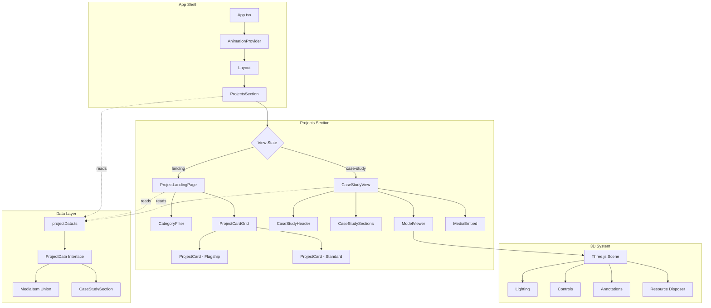
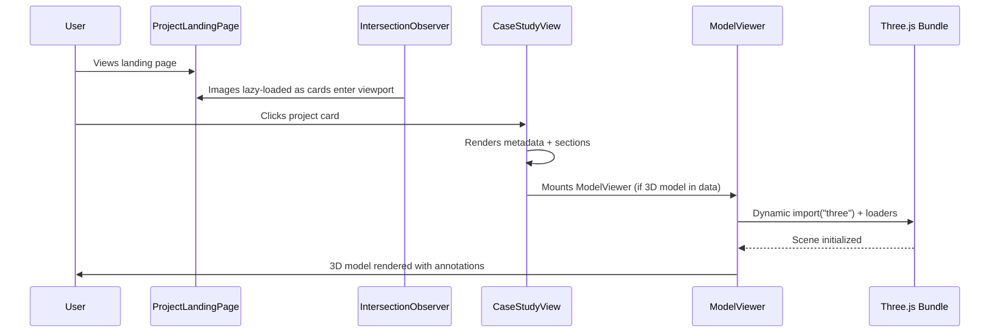

# Design Document: Project Section Overhaul

## Overview

This design transforms the portfolio's Projects section from a flat list of older Java projects into a professional engineering showcase with editorial layout, category filtering, interactive 3D model viewers, and structured case study narratives. The system replaces the current `ProjectList`/`CaseStudyView` toggle pattern with a richer component architecture while preserving the existing site structure (HashRouter, AnimationProvider, tokens.css, section ordering).

### Key Design Decisions

1. **Component-driven architecture** — Each concern (3D viewer, filtering, transitions, case study rendering) is isolated into its own component with a well-defined props interface, enabling independent testing and lazy loading.
2. **Data-driven rendering** — All project content lives in a typed data layer; components are pure renderers of that data. This makes content updates trivial and enables property-based testing of data transformations.
3. **Progressive enhancement for 3D** — Three.js is loaded lazily only when a case study with a 3D model is opened. The landing page never loads 3D assets. Fallback images ensure the experience degrades gracefully.
4. **Animation through existing infrastructure** — All scroll-triggered and transition animations use GSAP via the AnimationProvider context, respecting `prefers-reduced-motion` through the established `reducedMotionFallback` pattern.

---

## Architecture



### View State Management

The `ProjectsSection` component manages a simple view state discriminated union:

```typescript
type ProjectViewState =
  | { view: 'landing' }
  | { view: 'case-study'; projectId: string; returnScrollY: number };
```

Transitions between states are animated via GSAP timelines (fade-out → fade-in, 600ms total). The `returnScrollY` field enables scroll restoration on back-navigation.

### Lazy Loading Strategy



---

## Components and Interfaces

### ProjectsSection (Orchestrator)

```typescript
interface ProjectsSectionState {
  viewState: ProjectViewState;
  activeFilter: ProjectCategory;
}
```

Responsibilities:
- Manages view state transitions (landing ↔ case study)
- Orchestrates GSAP transition animations
- Stores scroll position for restoration
- Renders within existing `SectionWrapper` with `id="projects"`

### CategoryFilter

```typescript
type ProjectCategory = 'ALL' | 'MECHANICAL' | 'ROBOTICS' | 'SOFTWARE' | 'SYSTEMS';

interface CategoryFilterProps {
  categories: ProjectCategory[];
  activeCategory: ProjectCategory;
  onCategoryChange: (category: ProjectCategory) => void;
  resultCount: number;
}
```

Responsibilities:
- Renders filter buttons with active state styling
- Announces result count changes via `aria-live="polite"` region
- Keyboard-navigable (Tab + Enter/Space)
- Respects `prefers-reduced-motion` for transition timing

### ProjectCard

```typescript
interface ProjectCardProps {
  project: ProjectData;
  index: number;
  tier: 'flagship' | 'standard';
  onClick: () => void;
}
```

Responsibilities:
- Renders project number, title, summary, technologies, featured image
- Flagship tier: occupies ≥50% container width, renders first
- Standard tier: standard grid cell
- Focusable with visible focus ring (2px solid, accent color)
- Activates on click, Enter, or Space

### CaseStudyView

```typescript
interface CaseStudyViewProps {
  project: ProjectData;
  onBack: () => void;
}
```

Responsibilities:
- Renders project metadata header (title, categories, timeframe, role, technologies)
- Renders case study sections in data-defined order
- Embeds media (images, ModelViewer, diagrams) inline at specified positions
- Provides back navigation with focus management
- Uses semantic heading hierarchy (h2 title, h3 section headings)

### ModelViewer

```typescript
interface ModelViewerProps {
  modelSrc: string;
  fallbackImage?: string;
  projectTitle: string;
  projectDescription: string;
  annotations?: AnnotationData[];
  autoRotateSpeed?: number; // degrees/sec, default 6
}

interface AnnotationData {
  id: string;
  label: string;
  position: [number, number, number]; // 3D world coordinates
  cameraTarget?: [number, number, number];
}
```

Responsibilities:
- Loads GLB/GLTF via `GLTFLoader` (dynamic import)
- Applies studio lighting (ambient + directional + fill)
- OrbitControls for rotation/zoom (0.5x–3x range)
- Auto-rotation when idle ≥2s (4–10 deg/s)
- Renders annotations as CSS overlay labels connected by SVG/Canvas lines
- Pauses render loop when out of viewport (IntersectionObserver)
- Disposes all Three.js resources on unmount
- Shows loading spinner during load, fallback on failure/timeout
- `aria-label` from project title + description

### MediaEmbed

```typescript
interface MediaEmbedProps {
  media: MediaItem;
  lazy?: boolean;
}
```

Responsibilities:
- Renders appropriate element per media type (img, video, ModelViewer, iframe for PDF)
- Applies lazy loading via IntersectionObserver (1 viewport rootMargin)
- Maintains aspect ratio, max-width: 100% of container

---

## Data Models

### ProjectData Interface

```typescript
type ProjectCategory = 'ALL' | 'MECHANICAL' | 'ROBOTICS' | 'SOFTWARE' | 'SYSTEMS' | 'AI' | 'MATLAB' | 'LEADERSHIP' | 'CAD';

type MediaType = 'image' | 'video' | 'cad-render' | '3d-model' | 'gif' | 'diagram' | 'screenshot' | 'pdf';

interface MediaItem {
  type: MediaType;
  src: string;
  alt: string;   // max 125 chars, empty string for decorative
  caption?: string; // max 200 chars
}

type CaseStudySectionKey =
  | 'problem'
  | 'approach'
  | 'systems'
  | 'iteration'
  | 'decisions'
  | 'current-state'
  | 'lessons-learned'
  | string; // Allow project-specific keys (e.g., "chassis", "suspension")

interface CaseStudySection {
  key: CaseStudySectionKey;
  heading: string;
  body: string; // max 5000 chars
  media?: MediaItem[]; // inline media for this section
}

type VisualTier = 'flagship' | 'standard';

interface ProjectData {
  id: string;
  title: string;               // max 100 chars
  description: string;         // max 500 chars
  category: ProjectCategory[]; // 1–5 items
  technologies: string[];      // 1–15 items
  timeframe: string;
  role: string;
  media: MediaItem[];          // 0–50 items
  displayOrder: number;        // 1–99, ascending = first displayed
  visualTier: VisualTier;
  repositoryUrl?: string;      // valid URL
  caseStudySections?: CaseStudySection[];
}
```

### Data Validation Rules

| Field | Constraint | Enforcement |
|-------|-----------|-------------|
| `id` | Unique across all projects | Build-time assertion |
| `title` | 1–100 characters, non-empty | TypeScript branded type + runtime check |
| `description` | 1–500 characters | Runtime check |
| `category` | 1–5 items from enum | TypeScript tuple constraint |
| `technologies` | 1–15 items, non-empty strings | Runtime check |
| `displayOrder` | Integer 1–99 | TypeScript type + runtime check |
| `media[].alt` | 0–125 characters | Runtime check |
| `media[].caption` | 0–200 characters if present | Runtime check |
| `caseStudySections[].body` | 1–5000 characters | Runtime check |
| Missing content | `PLACEHOLDER:` prefix token | Regex validation |

### Content Placeholder Convention

```typescript
const PLACEHOLDER_PREFIX = 'PLACEHOLDER:';

function isPlaceholder(value: string): boolean {
  return value.startsWith(PLACEHOLDER_PREFIX);
}

// Example usage in data:
{
  key: 'decisions',
  heading: 'Engineering Decisions',
  body: 'PLACEHOLDER: [ADD SUSPENSION DESIGN RATIONALE]'
}
```

### Project Data Registry (6 Projects)

| Project | ID | Categories | Display Order | Visual Tier |
|---------|-----|-----------|---------------|-------------|
| RC Vehicle | `rc-vehicle` | MECHANICAL, CAD | 1 | flagship |
| Wankel Rotary Engine | `wankel-engine` | MECHANICAL, CAD | 2 | standard |
| FRC Team 116 | `frc-116` | ROBOTICS, MECHANICAL, LEADERSHIP | 3 | standard |
| STEM PathfindR | `stem-pathfindr` | SOFTWARE, AI | 4 | standard |
| Mission Control | `mission-control` | SOFTWARE, MATLAB | 5 | standard |
| Personal Server | `personal-server` | SYSTEMS, SOFTWARE | 6 | standard |

### Category → Filter Mapping

The `ALL` filter shows all projects. Other filters match if the project's `category` array includes the filter value. Note that `CAD`, `AI`, `MATLAB`, `LEADERSHIP` are data-level tags but are NOT filter categories — only the five filter options (ALL, MECHANICAL, ROBOTICS, SOFTWARE, SYSTEMS) appear in the UI.

```typescript
function filterProjects(projects: ProjectData[], filter: ProjectCategory): ProjectData[] {
  if (filter === 'ALL') return projects;
  return projects.filter(p => p.category.includes(filter));
}
```

---


## Correctness Properties

*A property is a characteristic or behavior that should hold true across all valid executions of a system — essentially, a formal statement about what the system should do. Properties serve as the bridge between human-readable specifications and machine-verifiable correctness guarantees.*

### Property 1: Data Validation Enforces All Field Constraints

*For any* generated `ProjectData` object, the validation function SHALL accept objects where: title is 1–100 characters, description is 1–500 characters, category has 1–5 items, technologies has 1–15 non-empty strings, displayOrder is an integer 1–99, media items have alt ≤125 characters and caption ≤200 characters, and caseStudySections bodies are ≤5000 characters; and SHALL reject objects that violate any of these constraints.

**Validates: Requirements 1.1, 1.3, 1.4**

### Property 2: Placeholder Detection

*For any* string, the `isPlaceholder` function SHALL return `true` if and only if the string starts with the literal prefix `"PLACEHOLDER:"`. No non-prefixed string shall be identified as a placeholder, and no prefixed string shall be missed.

**Validates: Requirements 1.5**

### Property 3: Display Order Sorting

*For any* array of `ProjectData` objects with distinct `displayOrder` values, sorting by `displayOrder` ascending SHALL produce an array where each element's `displayOrder` is less than or equal to the next element's `displayOrder`, and the resulting array contains exactly the same elements as the input.

**Validates: Requirements 1.6, 2.6**

### Property 4: ProjectCard Renders All Required Fields

*For any* valid `ProjectData` object, rendering a `ProjectCard` component SHALL produce output containing the project's title text, description text (truncated to 200 characters), at least one technology tag, and either a featured image element or a 3D model preview placeholder.

**Validates: Requirements 2.2**

### Property 5: Category Filter Returns Only Matching Projects

*For any* non-empty array of `ProjectData` objects and any selected category (excluding ALL), the `filterProjects` function SHALL return only projects whose `category` array includes the selected category, and SHALL return all such matching projects (no false negatives).

**Validates: Requirements 3.2, 3.8**

### Property 6: ALL Filter Is Identity

*For any* array of `ProjectData` objects, applying the `filterProjects` function with category `'ALL'` SHALL return an array identical to the input (same elements, same order, same length).

**Validates: Requirements 3.4**

### Property 7: Zoom Clamping

*For any* numeric zoom input value (including negative numbers, zero, and very large numbers), the zoom clamping function SHALL produce an output value in the inclusive range [0.5, 3.0], where values below 0.5 clamp to 0.5 and values above 3.0 clamp to 3.0, and values within the range are unchanged.

**Validates: Requirements 4.4, 9.2**

### Property 8: Accessible Label Composition

*For any* project title (1–100 chars) and project description (1–500 chars), the ModelViewer's `aria-label` attribute SHALL contain both the title and a truncated description such that the total label length does not exceed 125 characters, and the label is a non-empty string.

**Validates: Requirements 4.8, 8.1**

### Property 9: Case Study Section Order Preservation

*For any* valid `ProjectData` object with a non-empty `caseStudySections` array, rendering the `CaseStudyView` SHALL produce section elements in the DOM in the same order as the sections appear in the data array — the nth rendered section heading matches the nth data section heading.

**Validates: Requirements 5.1**

### Property 10: Case Study Metadata Completeness

*For any* valid `ProjectData` object, rendering the `CaseStudyView` header SHALL produce output containing the project title, at least one category tag, the timeframe string, the role string, and at least one technology tag — all sourced from the data object's corresponding fields.

**Validates: Requirements 5.2**

### Property 11: Media Embedded Within Correct Section

*For any* `CaseStudySection` with a non-empty `media` array, the rendered section DOM subtree SHALL contain media elements (img, video, canvas, or ModelViewer) whose `src` or data attributes correspond to the media items defined in that section's data, and SHALL NOT contain media items from other sections.

**Validates: Requirements 5.3**

### Property 12: Semantic Heading Hierarchy

*For any* rendered `CaseStudyView`, the project title SHALL be rendered as an `h2` element, and all case study section headings SHALL be rendered as `h3` elements — no heading level is skipped and no section heading uses a level equal to or higher than the title.

**Validates: Requirements 8.5**

### Property 13: Scroll Position Restoration

*For any* stored scroll position value (non-negative integer), when the back navigation is triggered, the restored scroll position SHALL be within 5 pixels of the stored value (|restored - stored| ≤ 5).

**Validates: Requirements 10.2**

---

## Error Handling

### 3D Model Loading Failures

| Scenario | Behavior |
|----------|----------|
| Network timeout (>10s on case study, >15s overall) | Cancel load, display fallback image if available |
| Network error (404, CORS, offline) | Display fallback image if available |
| No fallback image defined | Display styled placeholder with "Model unavailable" text |
| WebGL not supported | Display fallback image, hide canvas element |
| GLB/GLTF parse error | Treat as load failure, display fallback |

**Implementation pattern:**
```typescript
async function loadModel(src: string, timeout: number): Promise<GLTF | null> {
  const controller = new AbortController();
  const timer = setTimeout(() => controller.abort(), timeout);
  
  try {
    const gltf = await loader.loadAsync(src, undefined, controller.signal);
    clearTimeout(timer);
    return gltf;
  } catch (error) {
    clearTimeout(timer);
    return null; // Triggers fallback rendering
  }
}
```

### Three.js Resource Disposal

The `ModelViewer` component uses a `useEffect` cleanup function to dispose all allocated resources:

```typescript
useEffect(() => {
  return () => {
    scene.traverse((obj) => {
      if (obj instanceof Mesh) {
        obj.geometry.dispose();
        if (Array.isArray(obj.material)) {
          obj.material.forEach(m => m.dispose());
        } else {
          obj.material.dispose();
        }
      }
    });
    renderer.dispose();
    renderer.forceContextLoss();
  };
}, []);
```

### Data Layer Errors

| Scenario | Behavior |
|----------|----------|
| Project with empty required field | Render PLACEHOLDER: token visually (development mode: console warning) |
| Project with no caseStudySections | Render metadata only, no empty container |
| Media src resolves to 404 | Image onError handler shows broken-image placeholder |
| Invalid displayOrder (duplicates) | Sort is stable; duplicates maintain insertion order |

### Animation Error Recovery

| Scenario | Behavior |
|----------|----------|
| GSAP timeline interrupted | Kill existing timeline, start new one |
| IntersectionObserver unavailable | Fall back to eager loading (no lazy load) |
| Animation callback throws | ErrorBoundary catches, renders fallback UI |

### Component Error Boundaries

Each major component subtree wraps in an `ErrorBoundary`:
- `ModelViewer` — catches Three.js errors, renders fallback image
- `CaseStudyView` — catches rendering errors, shows "Unable to load case study" with back button
- `ProjectLandingPage` — catches grid/filter errors, shows simplified list

---

## Testing Strategy

### Dual Testing Approach

This feature uses both **unit/example-based tests** and **property-based tests** for comprehensive coverage:

- **Property tests** (fast-check): Verify universal correctness properties across 100+ random inputs
- **Unit tests** (vitest + @testing-library/react): Verify specific examples, edge cases, and integration points
- **Integration tests**: Verify Three.js lifecycle, IntersectionObserver behavior, and GSAP animations

### Property-Based Testing Configuration

**Library:** `fast-check` (already in devDependencies)
**Runner:** `vitest`
**Minimum iterations:** 100 per property
**Tag format:** `Feature: project-section-overhaul, Property {N}: {title}`

Each correctness property maps to exactly one property-based test:

| Property | Test File | What's Generated |
|----------|-----------|-----------------|
| 1: Data Validation | `src/__tests__/projectData.property.test.ts` | Random ProjectData objects (valid and invalid) |
| 2: Placeholder Detection | `src/__tests__/projectData.property.test.ts` | Random strings with/without PLACEHOLDER: prefix |
| 3: Display Order Sorting | `src/__tests__/projectData.property.test.ts` | Random arrays of projects with various displayOrder values |
| 4: ProjectCard Fields | `src/__tests__/components/ProjectCard.property.test.tsx` | Random valid ProjectData |
| 5: Category Filter | `src/__tests__/projectData.property.test.ts` | Random project arrays + random category selections |
| 6: ALL Filter Identity | `src/__tests__/projectData.property.test.ts` | Random project arrays |
| 7: Zoom Clamping | `src/__tests__/components/ModelViewer.property.test.ts` | Random floats (including extremes) |
| 8: Accessible Label | `src/__tests__/components/ModelViewer.property.test.ts` | Random title/description strings |
| 9: Section Order | `src/__tests__/components/CaseStudyView.property.test.tsx` | Random section arrays |
| 10: Metadata Completeness | `src/__tests__/components/CaseStudyView.property.test.tsx` | Random ProjectData |
| 11: Media in Section | `src/__tests__/components/CaseStudyView.property.test.tsx` | Random sections with media |
| 12: Heading Hierarchy | `src/__tests__/components/CaseStudyView.property.test.tsx` | Random ProjectData with sections |
| 13: Scroll Restoration | `src/__tests__/components/ProjectsSection.property.test.tsx` | Random scroll position integers |

### Unit / Example Tests

| Area | Test Scope |
|------|-----------|
| Static data validation | All 6 projects pass interface validation (smoke) |
| CategoryFilter rendering | 5 buttons present, active state styling, keyboard interaction |
| ModelViewer loading states | Spinner visible, fallback on error, fallback on no-image |
| ModelViewer lifecycle | dispose called on unmount, pause on visibility loss |
| Transition animation | Timeline phases execute in order, ≤600ms duration |
| Reduced motion | All components respect prefers-reduced-motion |
| Focus management | Focus moves to heading on open, returns to card on close |
| Responsive layout | Single column <768px, multi-column ≥768px |
| RC Vehicle specifics | 4 annotations, 3 version entries, correct section order |
| Wankel Engine specifics | 3 annotations, epitrochoidal config present |
| STEM PathfindR | Awards rendered with badge styling |
| Site preservation | id="projects" present, tokens.css variables used, no extra animation libs |

### Test Infrastructure

- **Three.js mocking**: Mock `three` module for unit tests; actual WebGL only in integration/e2e
- **GSAP mocking**: Use `gsap`'s test utilities or mock timelines for transition verification
- **IntersectionObserver mocking**: Use `jest-intersection-observer` polyfill in test environment
- **Reduced motion**: Mock `window.matchMedia` for prefers-reduced-motion testing
- **fast-check arbitraries**: Create custom arbitraries for `ProjectData`, `MediaItem`, `CaseStudySection` that respect all constraints

